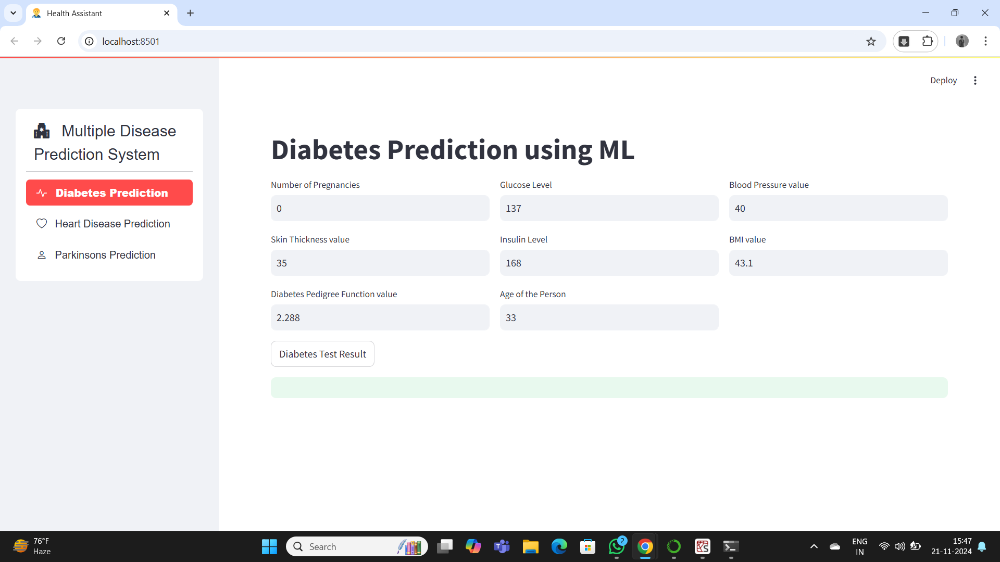
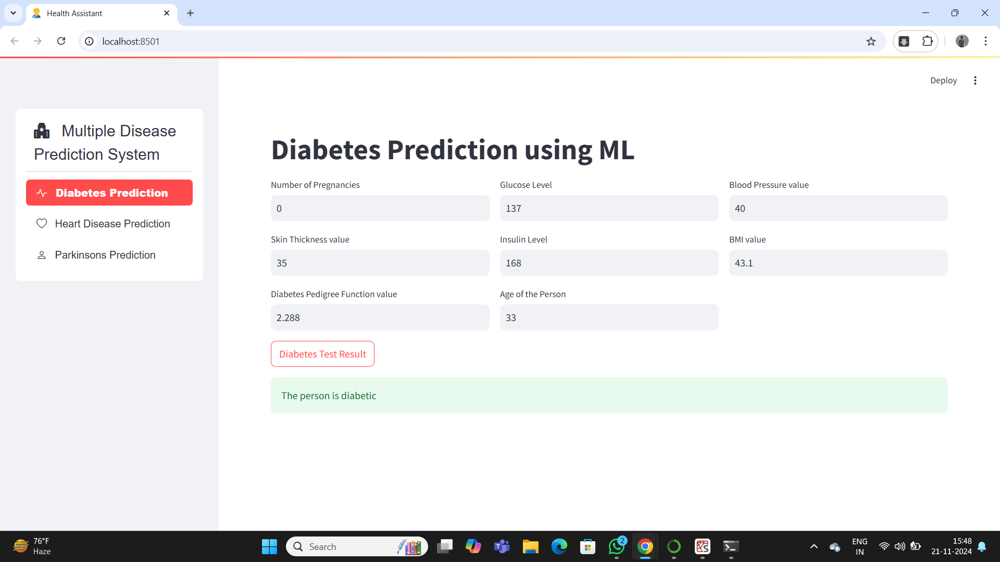

# Multiple Disease Prediction Using Machine Learning  

This repository contains a **Multiple Disease Prediction** project. The application predicts the likelihood of three diseases—**Heart Disease**, **Diabetes**, and **Parkinson's Disease**—using machine learning models trained on datasets sourced from Kaggle. The app is built with **Streamlit**, providing a user-friendly interface for making predictions.

---

## Features  

1. **Disease Predictions**:  
   - Heart Disease  
   - Diabetes  
   - Parkinson's Disease  

2. **Streamlit Web Application**:  
   - Interactive user interface for predictions.  
   - Upload input data or manually input features.  

3. **Pre-trained Machine Learning Models**:  
   - Models are trained and stored for real-time predictions.  

---

## Datasets  

The datasets for this project were sourced from Kaggle: 
All the datasets are available in the repository in a separate folder.

---

## Technologies Used  

- **Python**  
- **Libraries**:  
  - **Machine Learning**: scikit-learn, pandas, numpy, pickle 
  - **Web App**: Streamlit  
- **Tools**:  
  - Preprocessing and feature engineering for dataset preparation.  
  - Model persistence using `pickle`.  

---

## Project Workflow  

The project involves the following key steps to ensure accurate predictions and seamless functionality:  

### 1. **Data Preprocessing**  
   - **Loading the Dataset**:  
     The datasets are loaded from Kaggle and read into Pandas DataFrames for further processing.  
   - **Data Cleaning**:  
     Handle missing values by using techniques like imputation or removing rows/columns, depending on the dataset.  
   - **Feature Selection**:  
     Identify and select the most relevant features for prediction to improve model performance.  
   - **Feature Scaling**:  
     Normalize or standardize the data (e.g., using MinMaxScaler or StandardScaler) to ensure compatibility with machine learning algorithms.  

### 2. **Model Training**  
   - **Splitting Data**:  
     Each dataset is split into training and testing sets using `train_test_split`. Typically, 80% of the data is used for training, and 20% is used for testing.  
   - **Choosing Models**:  
     Use various machine learning classifiers such as:  
     - Logistic Regression   
   - **Training**:  
     Train each model on its respective disease dataset.  
   - **Evaluation**:  
     Evaluate the models using metrics such as:  
     - Accuracy  
     - Precision  
     - Recall  
     - F1 Score  
   - **Saving the Models**:  
     Save the trained models using libraries like `pickle` for use in the Streamlit app.  

### 3. **Web Application Development**  
   - **Building the UI**:  
     Develop a simple and user-friendly interface using Streamlit, allowing users to:  
       - Input data manually or upload files.  
       - Choose the disease they want to predict.  
   - **Model Integration**:  
     Load the pre-trained models and use them for real-time predictions based on user input.  
   - **Display Results**:  
     Show the prediction results, including the likelihood of the disease, in a clear and intuitive format.  

---

## How to Run  

Follow these steps to set up and run the project on your local system:  

### Prerequisites  
- Python 3.8 or later installed on your system.  
- install the required Python libraries.  
- Datasets downloaded (if not already included in the repository).  

### Step 1: Clone the Repository  
Clone this repository to your local system using Git:  
```bash
git clone https://github.com/your-username/multiple-disease-prediction.git
cd multiple-disease-prediction
```

### Step 2: Install Dependencies  
Install the required Python libraries :  

```bash
pip install numpy
pip install sreamlit
pip install stream-option-menu
pip install pickle
```
### Step 3: Run the Streamlit App  
Run the Streamlit application to launch the web interface:  

```bash
streamlit run MDP.py
```
### Step 4: Access the Application  
After running the Streamlit app, a local URL will be generated, typically:  

```text
http://localhost:8501
```
### Step 5: Use the Application  

1. **Select a Disease**:  
   Choose the disease you want to predict (Heart, Diabetes, or Parkinson's) from the dropdown menu.  

2. **Input Features**:  
   - Manually enter the required features in the input fields provided.  
   - Alternatively, upload a CSV file containing the input data.  

3. **Make Predictions**:  
   Click the **"Predict"** button to generate predictions.  

4. **View Results**:  
   The application will display the prediction result, including the likelihood of the selected disease.

## Screenshots  

### Screenshot 1: Disease Prediction UI


### Screenshot 2: Results Display



## Future Improvements  

- **Add More Diseases for Prediction**:  
  Extend the current model to include additional diseases for prediction, providing a broader scope for the application.

- **Improve the UI for a Better User Experience**:  
  Enhance the visual design and interactivity of the Streamlit app, making it more user-friendly and intuitive. This could include adding better input validation, clearer results presentation, and visualizations.

- **Use More Advanced Models or Ensemble Techniques for Higher Accuracy**:  
  Implement more sophisticated machine learning models, such as Gradient Boosting, XGBoost, or neural networks, to improve the accuracy of predictions. Additionally, combining multiple models using ensemble techniques like bagging or boosting could further enhance the results.
